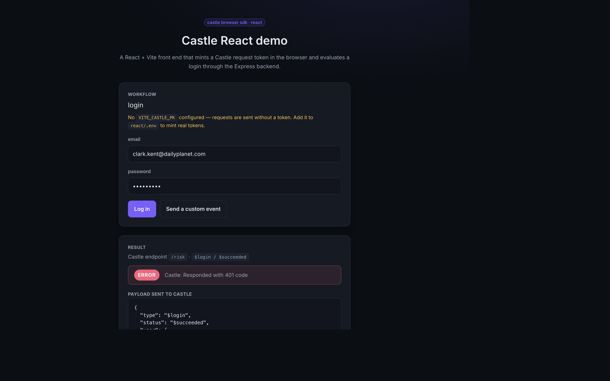

# Castle React integration

A small **React + Vite + TypeScript** front end that shows how to integrate the
Castle browser SDK ([`@castleio/castle-js`](https://www.npmjs.com/package/@castleio/castle-js))
in a React app and drive the Express demo backend in this repo.



It demonstrates the patterns that matter when wiring Castle into React:

- **Configure the SDK once.** `CastleProvider` calls `Castle.configure({ pk })`
  a single time (guarded against React StrictMode's double mount) and exposes a
  typed API via the `useCastle()` hook.
- **Mint a fresh request token per action.** The login form calls
  `createRequestToken()` on submit and forwards it to the backend, which sends
  it to Castle's `risk` / `filter` endpoint.
- **Degrade gracefully.** With no publishable key the hook still resolves
  (returning an empty token) so the UI keeps working.
- **Custom events.** `trackCustom()` wraps `Castle.custom(...)`.

## Layout

```
react/
├── src/
│   ├── castle/CastleProvider.tsx   # configure() once + useCastle() hook
│   ├── components/LoginForm.tsx    # createRequestToken() on submit
│   ├── components/ResultPanel.tsx  # renders the verdict + raw JSON
│   ├── api.ts                      # typed fetch to /evaluate_login
│   └── App.tsx
├── vite.config.ts                  # proxies API routes to the Express backend
└── tailwind.config.js              # shared dark-theme design tokens
```

## Running it

The React app talks to the Express backend in the repo root, so run both.

1. Start the backend (from the repo root):

   ```bash
   npm install
   npm start          # http://localhost:4006
   ```

2. In another terminal, start the React app:

   ```bash
   cd react
   npm install
   cp .env.example .env   # then set VITE_CASTLE_PK
   npm run dev            # http://localhost:5173
   ```

Vite proxies the API routes (`/evaluate_login`, …) to the backend on port 4006,
so the browser talks to a single origin. Override the target with
`VITE_BACKEND_URL` if your backend runs elsewhere.

## Building

```bash
npm run build      # type-checks with tsc and bundles to dist/
npm run preview    # serve the production build locally
```
