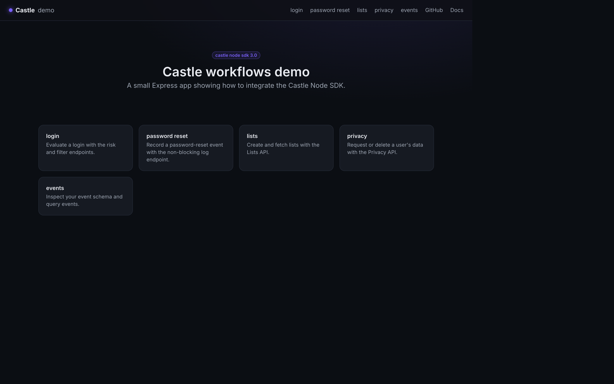
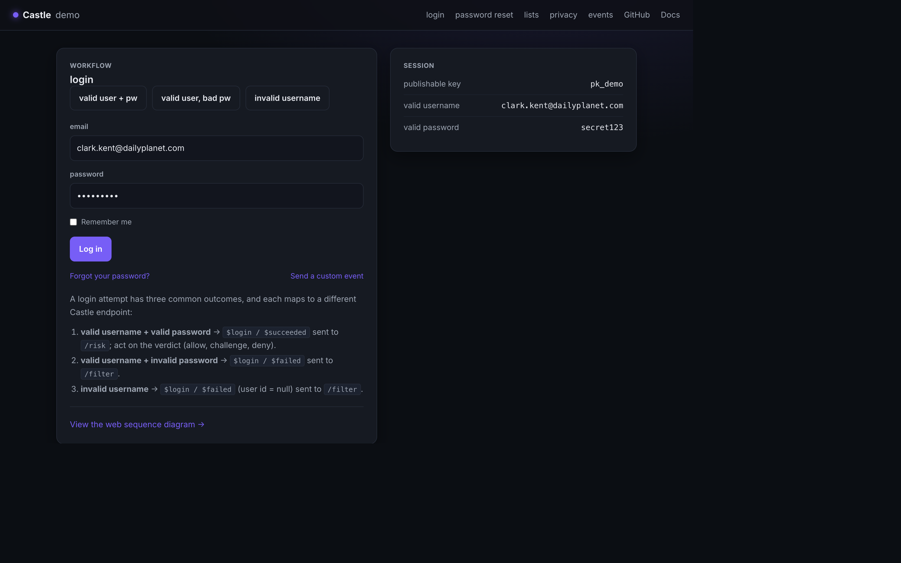

# Castle demo application: Node

This project demonstrates key components of several essential Castle workflows. It is built in Node.js on Express and uses the [Castle Node SDK](https://github.com/castle/castle-node) (3.0).

## What's demonstrated

- **login** – `risk` (successful login) and `filter` (failed login) endpoints, with the verdict (allow / challenge / deny), risk score and signals surfaced in the UI
- **password reset** – the non-blocking `log` endpoint
- **lists** – the Lists API (`createList`, `fetchAllLists`)
- **privacy** – the Privacy API (`requestUserData`, `deleteUserData`)
- **events** – the Events API (`eventsSchema`, `queryEvents`)

The browser SDK is also used to track page views (`Castle.page()`) and send an
ad-hoc custom event (`Castle.custom()`).

## Screenshots

| Home | Login |
| ---- | ----- |
|  |  |

## Prerequisites

You'll need a Castle tenant to run this app against. If you don't already have one, you can start a free trial at https://castle.io.

From your Castle dashboard you'll need two values:

- your **publishable key** (`pk`) – used by the browser SDK
- your **API secret** – used by the backend SDK

## Running locally

This is a Node.js app. The Castle Node SDK 3.0 requires **Node.js 20 or newer**.

Clone the repo and change into it:

```bash
git clone https://github.com/castle/castle-node-example.git
cd castle-node-example
```

Install the dependencies. This also installs the browser SDK
(`@castleio/castle-js`), which is served at runtime straight from
`node_modules` (at `/vendor/castle-js/...`), so there's no file to copy or
commit:

```bash
npm install
```

> **Note on the SDK version.** This example uses Castle Node SDK `3.0`. Until it
> is published to npm, `package.json` references a bundled tarball
> (`castleio-sdk-3.0.0.tgz`). Once `3.0` is on npm, change the dependency to
> `"@castleio/sdk": "^3.0.0"` and delete the tarball.

Create your `.env` from the example and fill in your Castle publishable key (`castle_pk`), API secret (`castle_api_secret`) and a `valid_password`:

```bash
cp .env_example .env
```

Run the app:

```bash
npm start
# Castle Node demo listening on http://localhost:4006
```

For development with auto-reload:

```bash
npm run dev
```

## Styling (Tailwind CSS)

The UI is styled with [Tailwind CSS](https://tailwindcss.com). The source lives in
`src/tailwind.css` (design tokens are configured in `tailwind.config.js`) and is
compiled to `static/styles.css`, which is committed so `npm start` and the Docker
image work without a build step.

If you change the templates (`views/`) or `src/tailwind.css`, regenerate the
stylesheet:

```bash
npm run build:css      # one-off, minified build
npm run watch:css      # rebuild on change during development
```

## Running the tests

The app is covered by a Jest + Supertest suite (no network access or API secret
needed):

```bash
npm test
```

It includes three layers:

- **route tests** (`test/app.test.js`) — the endpoint logic with the Castle
  client stubbed (e.g. login routing to `risk` vs `filter`).
- **SDK integration tests** (`test/sdk-integration.test.js`) — the *real* Castle
  SDK driven through its `overrideFetch` hook, asserting the request URL,
  method, auth header and JSON body, plus response parsing, error mapping and
  failover behaviour.
- **front-end tests** (`test/frontend.test.js`) — the verdict banner rendering,
  run against `static/app.js` in jsdom.

## Running with Docker

The bundled `Dockerfile` builds from local source and serves the app on port 80.

Build the image:

```bash
docker build -t castle-demo-node .
```

Run a container. The non-secret demo values (`valid_username`, `valid_user_id`, etc.) are baked into the image, so you only need to pass your secrets:

```bash
docker run -d -p 4006:80 \
  -e castle_pk=YOUR_PUBLISHABLE_KEY \
  -e castle_api_secret=YOUR_API_SECRET \
  -e valid_password=YOUR_VALID_PASSWORD \
  castle-demo-node
```

The app will be available at http://127.0.0.1:4006.

## Disclaimer

I’m sharing this sample app with the hope that other developers find it valuable. Although it is not an officially supported sample, we welcome questions and suggestions at `support@castle.io`.
